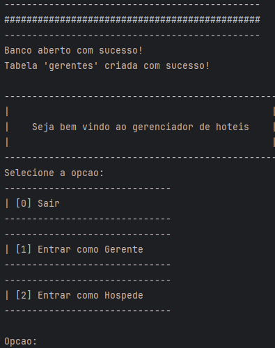
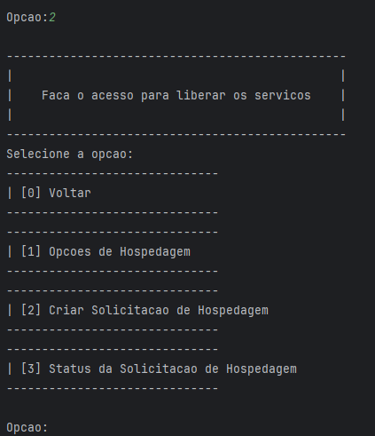
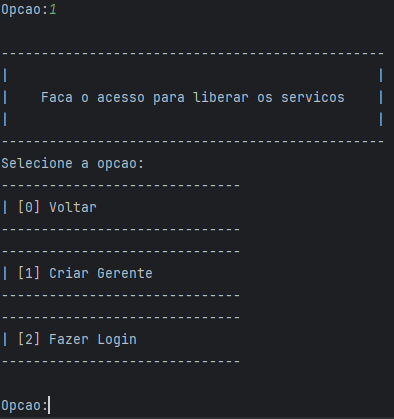
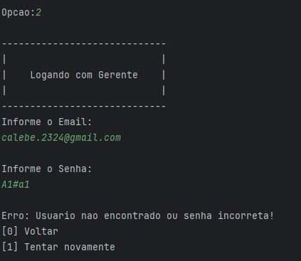
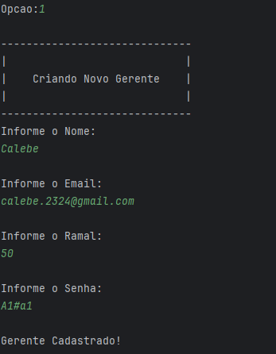
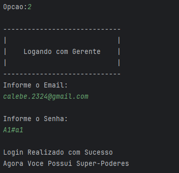
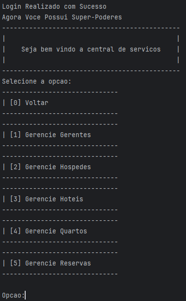
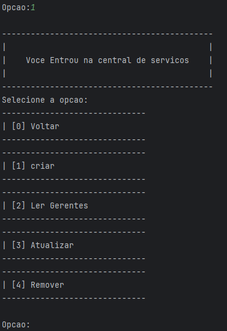
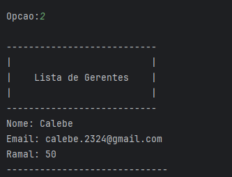

# 🏨 Gerenciador de Hotel - UnB

Projeto acadêmico em **C++**, desenvolvido na Universidade de Brasília (UnB), com foco em **Programação Orientada a
Objetos (POO)** e persistência de dados com **SQLite**.

O sistema simula um **gerenciador de hotel**, permitindo:

- Cadastro e login de **hóspedes** e **gerentes**
- Registro e gerenciamento de **quartos**, **reservas** e **hotéis**
- Validação de dados diretamente nas classes de domínio
- Navegação por menus interativos via **interface de terminal (CLI)**

---

## 🚀 Atualizações Recentes

- ✅ Interface de terminal funcional com menus dinâmicos
- ✅ Persistência com SQLite (`hotel.db`)
- ✅ Criação, login, leitura e exclusão de gerentes
- ✅ Fluxo completo para hóspedes com opções de hospedagem
- ✅ Validação embutida nos domínios com tratamento de exceções
- ✅ Remoção das classes de validação externas (`validadores_abstratos`)
- 🔄 Função de atualização de gerente em desenvolvimento

---

## 🧭 Linha do Tempo de Funcionalidades

| Etapa | Funcionalidade      | Descrição                                            |
|-------|---------------------|------------------------------------------------------|
| 1️⃣   | Tela Inicial        | Escolha entre gerente ou hóspede                     |
| 2️⃣   | Acesso como Gerente | Menu com opções de criar, logar e gerenciar          |
| 3️⃣   | Criar Gerente       | Cadastro com validação de nome, email, ramal e senha |
| 4️⃣   | Login de Gerente    | Verificação no banco com feedback de sucesso ou erro |
| 5️⃣   | Central de Serviços | Acesso às operações CRUD de gerentes                 |
| 6️⃣   | Ler Gerentes        | Listagem formatada dos gerentes cadastrados          |
| 7️⃣   | Remover Gerente     | Exclusão por email com confirmação                   |
| 8️⃣   | Acesso como Hóspede | Menu com opções de hospedagem e status               |
| 9️⃣   | Criar Solicitação   | Interface para registrar interesse em hospedagem     |
| 🔟    | Ver Status          | Consulta ao status da solicitação feita              |
| 🔜    | Atualizar Gerente   | (Em desenvolvimento) Edição de dados do gerente      |

---

## 📸 Exemplos Visuais da Interface

---

### 🏁 Tela Inicial do Sistema

---

### 🛏️ Menu para Hospedagem

---

### 🧑‍💼 Menu Inicial do Gerente

---

### ❌ Tentativa de Login com Erro

---

### 👤 Cadastro de Novo Gerente

---

### 🔐 Login de Gerente com Sucesso

---

### 🧠 Central de Serviços

---

### 🧭 Menu CRUD de Gerentes

---

### 📋 Lista de Gerentes

---

## 📂 Estrutura do Projeto

├── include/
│ ├── entidades/
│ ├── dominios/
│ ├── sistema/
│ ├── utilitarios/
├── src/
│ ├── sistema/
│ ├── persistencias/
│ ├── servicos/
│ ├── entidades/
│ ├── dominios/
├── libs/
│ ├── sqlite/
│ ├── testes/
├── README.md

---

## 🔹 Validação Embutida nos Domínios

A validação de dados agora é feita diretamente dentro das classes de domínio. Cada classe é responsável por garantir sua
própria integridade, lançando exceções (`std::invalid_argument`) quando os dados são inválidos.

Exemplos:
Nome nome("Calebe"); // válido  
Email email("email@invalido"); // lança exceção  
Senha senha("123"); // lança exceção se não atender aos critérios

### 🔹 Utilitários Genéricos

Algumas validações genéricas ainda são mantidas para entradas livres:

- ValidarString → valida strings genéricas (menus, comandos)
- ValidarInt → valida inteiros fora dos domínios

---

## 🧪 Testes

- TesteValidadores: conjunto de testes unitários para verificar os domínios
- Contadores estáticos para monitorar execução:
    - contTotalTestes
    - contTotalTestesOk
    - contTotalTestesProblema

---

## 🛠️ Como Compilar

mkdir build && cd build  
cmake ..  
make  
./gerenciador_hotel_unb

⚠️ Certifique-se de que o SQLite está corretamente incluído no projeto (libs/sqlite/sqlite3.c)

---

## 📚 Próximos Passos

1. Finalizar função de atualização de gerente
2. Implementar persistência para hóspedes e solicitações
3. Criar exportação de dados para .tsv ou .csv
4. Ampliar cobertura dos testes
5. Migrar para interface gráfica (Qt ou Web)

---

## 🎯 Objetivo Educacional

Este projeto visa aplicar conceitos de **POO em C++ moderno**, com foco em:

- Herança e Polimorfismo
- Encapsulamento
- Tratamento de exceções
- Arquitetura limpa e boas práticas
- Persistência com banco de dados

---

## 👤 Autor

Projeto desenvolvido por **Calebe Alves** — Universidade de Brasília (UnB)  
📎 Repositório: https://github.com/CalebeAF02/gerenciador_hotel_unb